### Theory

**1) Fully controlled AC Voltage controller with R-L Load**

The circuit configuration of fully controlled AC voltage controller is given in Fig. 1.

  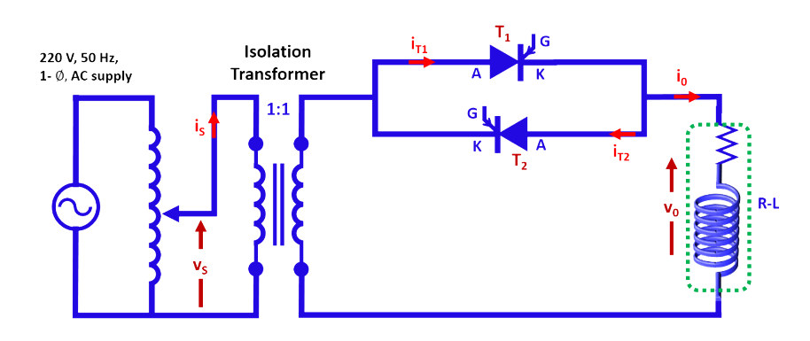
  
Fig. 1. Circuit configuration of AC voltage controller.

 
The principle of operation of the above circuit can easily be understood from the waveforms given in Fig. 2.
 

  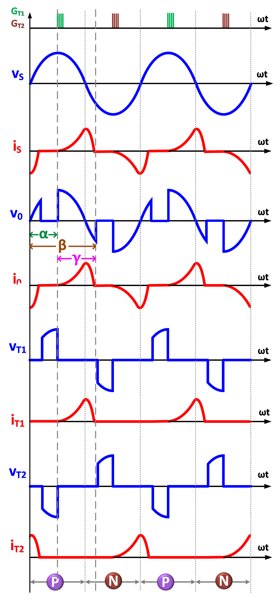
  
 Fig. 2. Typical waveforms with R-L load (α<90&#176;).

 
Voltage appearing across load is defined by
  

 

  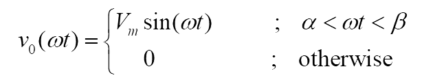

    ..(1)

 

 
Applying Kirchhoff’s voltage law
  

  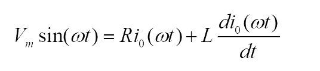
      

    ..(2)

 
Solving the above equation

 

  
      

    ..(3)

 
where
  

  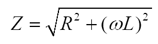
      

    ..(4)

 
  
and

 

  
      

    ..(5)

 

 
  
Let

 

  
      

    &nbsp;

 

 
For the given firing angle and R-L load parameters, the extinction angle is obtained by solving the equation given below.
  

  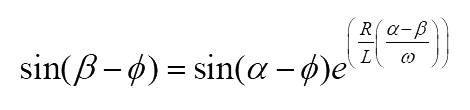
      

    ..(6)

and conduction angle

  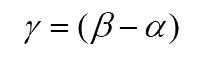
      

    ..(7)

 

The condition to get controlled output is

  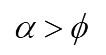
      

    ..(8)

 

otherwise the load voltage will be same as the input voltage.
  
The fundamental component of load voltage can easily be obtained from the Fourier coefficients and it is given below.

  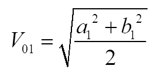
      

    ..(9)

 
 

where

  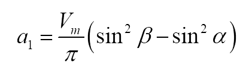
      

    ..(10)

 
 

and

  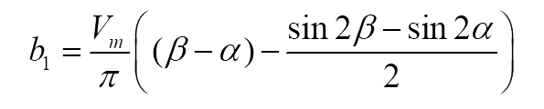
      

    ..(11)

 
 

Total harmonic distortion (THD) in the load voltage is given by

  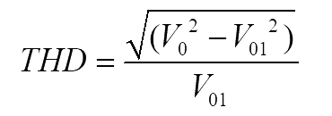
      

    ..(12)

 

 

**2) Asymmetrical or Semi-controlled AC Voltage controller with R-L Load**

The circuit configuration of semi-controlled AC voltage controller is given in Fig. 3.

  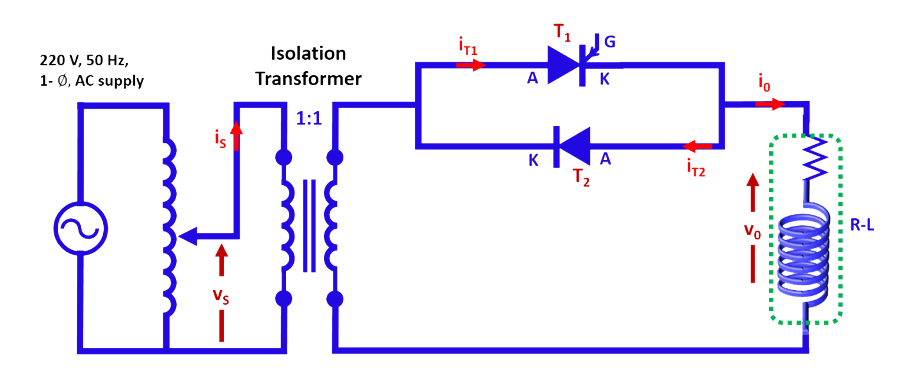
  
Fig. 3. Circuit configuration of semi-controlled AC voltage controller.

 

 

The corresponding waveforms are given in Fig. 4.

  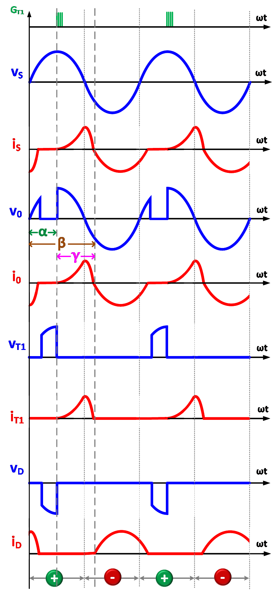
  
Fig. 3. Typical waveforms with R-load (α<90&#176;).

 

 

Let the source voltage be

  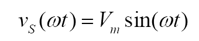
      

    ..(13)

 

 

Then the load voltage is

  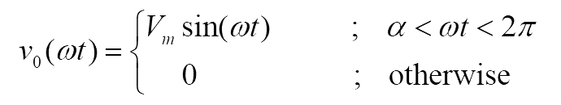
      

    ..(14)

 

Hence the RMS value of load voltage is:

  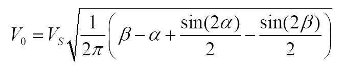
      

    ..(15)

 

and RMS load current is given by 

  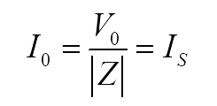
      

    ..(16)

 

Since the output voltage is not identical in positive and negative half cycle, the output voltage waveform exhibits DC-offset which is given by

  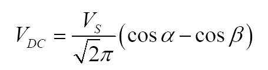
      

    ..(17)

